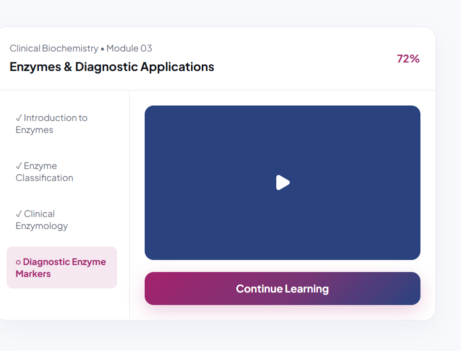

# ALS — Academy for Laboratory Science

A premium, responsive laboratory-science learning platform built with Next.js, React, TypeScript, and Tailwind CSS.

## Demo preview



## Student experience

- Public academy homepage and demo sign-in
- Student dashboard and course catalogue
- Clinical Biochemistry course overview and learning player
- Live classes and simulated classroom interactions
- Exams, question navigation, review, and results
- Learning progress and topic-performance reporting
- Certificates, notifications, and help centre
- Responsive desktop, tablet, and mobile navigation

All current content and interactions use typed local mock data. Backend integration is intentionally deferred.

## Run locally

```bash
pnpm install
pnpm dev
```

Open [http://localhost:3000](http://localhost:3000).

## Validation

```bash
pnpm lint
pnpm build
```

## Technology

- Next.js 16 App Router
- React 19
- TypeScript
- Tailwind CSS
- Lucide icons
- Next/Image optimized local assets
