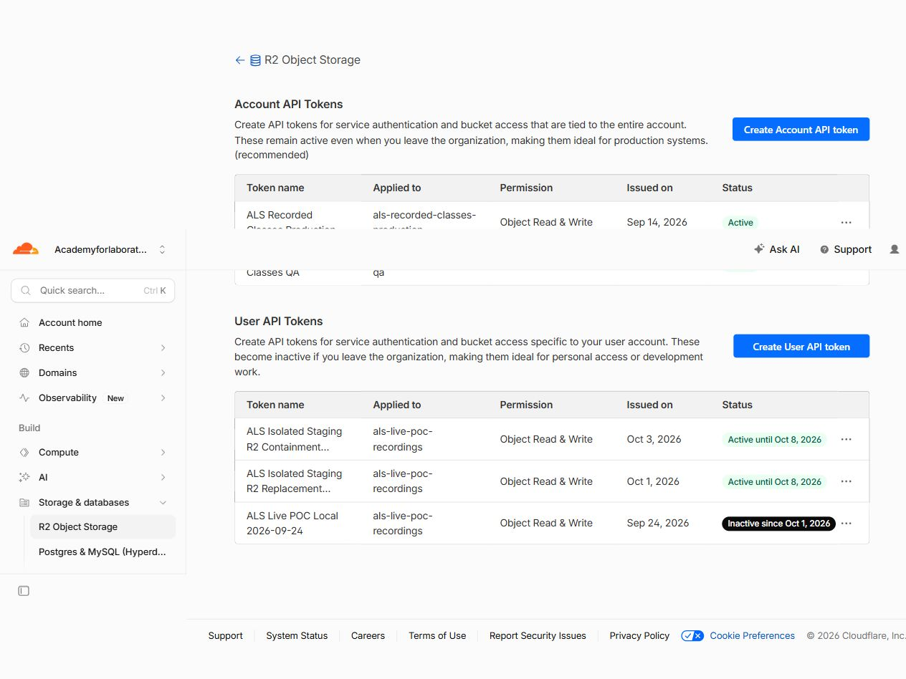
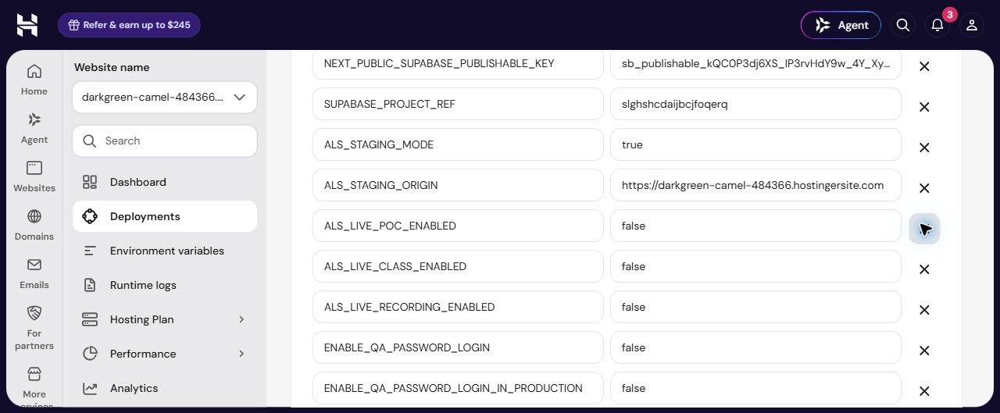
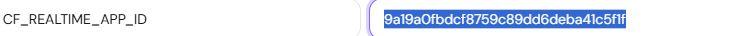
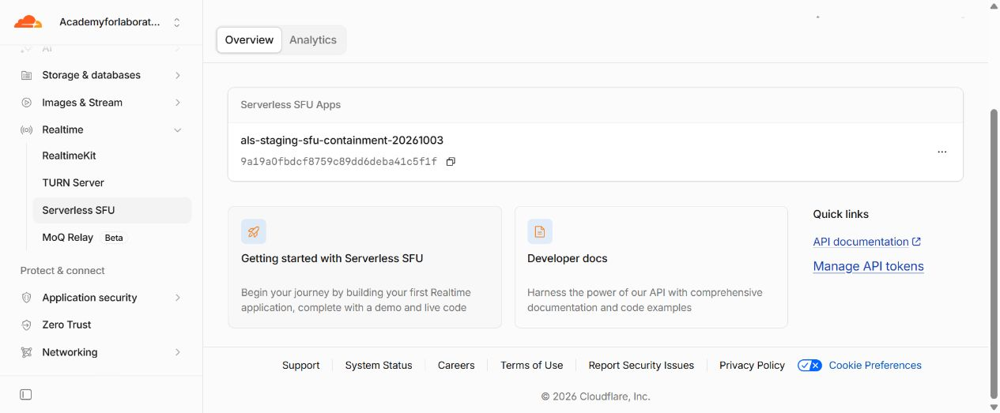
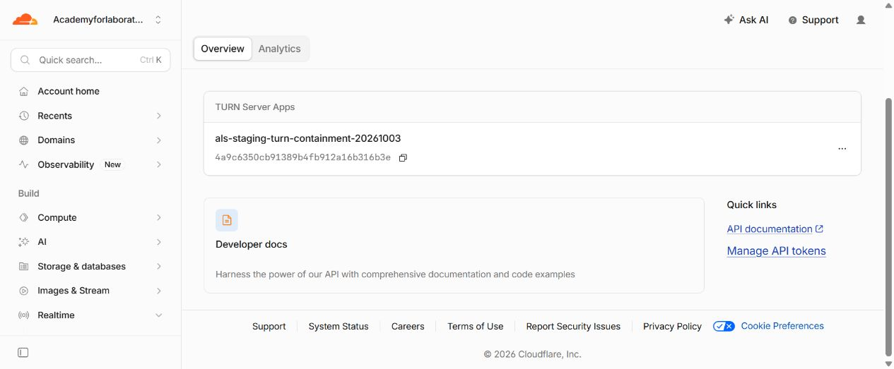
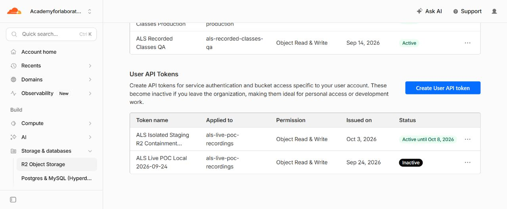

# ALS staging credential containment — 3 October 2026

## Current checkpoint

**Credential containment passed. Deployment, provider authentication, old-access rejection, Vault/local consumers and academic checks are verified. Exactly the three confirmed old Cloudflare resources and old individually managed Supabase key were retired. Hosted Step 5 acceptance is prepared but has not run; Chrome control is currently blocked during live-window preparation.**

The owner separately approved containment of the staging credentials exposed during Step 5. This approval covers only the verified staging SFU/TURN, bucket-scoped R2 credentials, individually managed Supabase server key, staging gate phrase/cookie secret and cleanup token. It does not authorize Production, shared consumers, new subscriptions, billing changes, another bucket or a signing-key rotation.

## Verified scope and dependencies

- Cloudflare account: `c595e85a425e3e575b97d71c994f2e69`.
- Supabase project: `slghshcdaijbcjfoqerq`, `als-live-staging`, organization `oenarbsvxrmnsvugjdrz`.
- Existing protected app: `https://darkgreen-camel-484366.hostingersite.com`.
- Existing private bucket: `als-live-poc-recordings`.
- Exact exposed values matched only designated, ignored ALS staging configuration among the inspected local projects. The three matching files and labels are recorded in `dependencies.json`.
- The paused cleanup cron references the existing Vault entry by name. The verified entry ID is `88731886-8d08-4999-ad18-6609fdca9721`, name `als_staging_cleanup_token`. No other matching Vault consumer or Edge Function was found.
- No Production/shared dependency was found in the inspected consumers. Uninspected remote consumers remain **UNKNOWN**.
- Hostinger's 25 settings privately matched the saved staging baseline before replacement preparation. Source remains the already deployed Step 5 fix, SHA `3032ed0527ce801a1a675fd331be37bc2a35f002`.

## Replacement inventory

| Resource | Old identity, retired | Replacement identity | Provider verification |
| --- | --- | --- | --- |
| SFU | `als-staging-sfu-containment-20261001`, `6306f9d5f836a1aa08b0d6bbde22f10b` | `als-staging-sfu-containment-20261003`, `9a19a0fbdcf8759c89dd6deba41c5f1f` | Empty session creation HTTP 201; exact new app session inspection HTTP 200, zero tracks, at 07:47:50.954 UTC. The session was subsequently terminal: HTTP 410 `session_error` at 08:53:31.799 UTC. |
| TURN | `als-staging-turn-containment-20261001`, `19951d8aa17f40210ffc756ba8c1ba3a` | `als-staging-turn-containment-20261003`, `4a9c6350cb91389b4fb912a16b316b3e` | Short-lived credential generation HTTP 201, TTL 60 seconds, at 07:47:50.954 UTC. Generated credentials were not output or retained. |
| R2 user token | `ALS Isolated Staging R2 Replacement 2026-10-01` | `ALS Isolated Staging R2 Containment 2026-10-03` | Object Read & Write on the same single bucket; displayed active until 8 October. An owned 1,024-byte object passed Put/Head/Get/Delete and post-delete HTTP 404 at 08:13:20.991 UTC. No unrelated objects were read or altered. |
| Supabase server key | `als_hostinger_staging_containment_2026_10_01`, `87d6c502-407c-4071-835d-5bed4e1fb811` | `als_hostinger_staging_containment_2026_10_03`, `912b2fdd-e98b-46ed-afe3-e2c1c22a60db` | Read-only lookup of the existing synthetic Teacher through Auth Admin returned HTTP 200 at 07:13:01.531 UTC. No signing key or account password was rotated. |
| Gate and cleanup | Existing exposed staging settings, rejected | Fresh random staging-only values installed | Hosted new phrase/cookie/token accepted; old phrase/cookie/token rejected; exact existing Vault entry updated and verified. |

Only one replacement of each provider resource was created. The SFU verification session ID is `722a6610403d7577f4fe14bf9bcd41dd891ec6649fee8d77b6a449645415cea1`; it has no active media and is expired. API tokens, object-access IDs/secrets, temporary TURN credentials and account passwords are not included in this report.

The existing conservative R2 guard `2026-10-08T00:00:00Z` is preserved. Cloudflare's date display does not expose an exact expiration hour/timezone, so no provider hour is inferred.

## Hostinger preparation and unsuccessful import

An ignored, designated local import file contains exactly 25 settings. Exactly ten approved credential settings change; the other fifteen, including all three false media flags and operational/credential window bounds, remain identical. Secret values have not entered source, Git, ZIP, documentation or public evidence.

The computer-use confirmation policy requires the owner to enter and submit replacement authentication credentials in the browser. The owner was given the exact prepared import path and the existing app's **Use previous files** workflow.

Deployment `01a100f1-6997-71b9-915d-5878ae3035b6` completed, but its private saved-settings readback showed all ten replacement settings still held their old values. No duplicate settings were present; all media flags remained false. **This deployment is not a successful containment deployment.** A corrected owner import was requested, with the non-secret new SFU app ID as a visible verification marker before submitting.

A second owner-submitted deployment, `01a100ff-2889-7112-9165-0e9d3cc81970`, also completed with the ten old values. A direct, read-only gate inspection at **09:07:41.805 UTC** confirmed that the running app still accepted the old signed gate cookie (HTTP 200) and rejected the replacement signed cookie (redirect HTTP 307). This distinguishes active runtime state from source-reuse form defaults. Neither completed deployment is a containment PASS.

The import failure's cause is unproven. Changing the file to the conventional `.env` filename did not establish replacement. The next handoff uses a different preparation: exactly ten old credential rows were removed only from the **unsaved redeploy form**. The remaining fifteen settings were privately verified identical. Nothing was submitted by the agent, and deployed settings were unchanged. The owner is asked to import the prepared file and let the agent verify a full, exact 25-setting form before owner submission. A screenshot of this prepared form contains no secret credential fields.

The revised import succeeded: the unsaved form contained exactly 25 settings, no duplicate labels, all ten expected replacements, and the fifteen preserved values. All three media flags remained false. The owner then submitted deployment `01a10128-0437-733e-be6f-aa48ae9c8892`, started at **09:46:02 UTC** (Hostinger display 13:46:02 Dubai). This is an import/submission milestone; completion and running-app verification are still required before revocation.

Deployment `01a10128-0437-733e-be6f-aa48ae9c8892` was observed **Current/Completed at 09:49:27.212 UTC**. Private saved readback at **09:49:46.873 UTC** matched all 25 intended settings, with media flags false and no mismatches.

Hosted verification at **09:50:07.836 UTC** proved: no gate cookie redirects (307); old gate cookie redirects (307); old phrase is rejected (401); new phrase is accepted (303) and login loads (200); new Supabase server key authenticates (200); old cleanup token is rejected (404); new cleanup token succeeds (200) with zero candidates, zero provider calls and zero media-row changes. Only the existing Vault entry `88731886-8d08-4999-ad18-6609fdca9721` was updated and its exact replacement was privately verified. Cron stayed paused at run ID 72.

Genuine normal-UI Student, Teacher and Admin logins passed. The fresh read-only academic run passed all 21 checks, including expired/ineligible access denial. At **09:55:08.599417 UTC**, academic/enrollment/recording preservation matched the pre-submission observation exactly, with zero active media resources.

Under the separate containment approval, exactly old Supabase key `87d6c502-407c-4071-835d-5bed4e1fb811` was revoked at **09:56:53.233 UTC**. Key inventory showed it absent; old authentication returned 401; replacement key `912b2fdd-e98b-46ed-afe3-e2c1c22a60db` still returned 200. No signing key or password was rotated.

The owner gave the computer-use policy's action-time confirmation for exactly the three named old Cloudflare resources. UI absence was observed for old TURN at **09:58:51.932 UTC**, old SFU at **09:59:42.722 UTC**, and old R2 token at **10:02:16.824 UTC**. Replacement rows remained present; unrelated Production/QA R2 tokens and the older expired staging token were retained. No bucket, subscription or billing plan was changed.

Post-revocation checks at **10:03:01.741 UTC** proved old SFU HTTP 404, old TURN HTTP 404 and old R2 HTTP 401. Replacement SFU authenticated and returned 410 `session_error` for the exact expired empty verification session; replacement TURN generated a 60-second credential (201), never output or retained; replacement R2 authenticated on the owned deleted verification object (404). No unrelated object was read or altered.

At **10:03:09.392 UTC**, only the previously verified matching labels were installed in the three designated ignored staging consumer files. Every other value, including flags and expiry, was privately compared unchanged. Pending import copies remain temporarily ignored for completing the acceptance configuration/readback and will be removed after final restoration.

## Step 5 acceptance preparation

Exactly one fresh class was scheduled through the genuine Admin UI: `09b74889-c4e0-42b3-8743-afd0059ca5d8`, **Synthetic ALS Student Auto-End — 3 Oct 2026**. It uses the existing assigned Teacher and known-valid synthetic Program/Subject/Batch, one receiver, recording disabled. Separate Teacher Chrome and Student 1 in-app-browser pages were signed in and prepared while media remained disabled. No class was started and no microphone publication was created.

At **10:10:15.558427 UTC**, all global media/database counts were zero, cron remained paused at run ID 72, the fresh class remained scheduled, and retained recording/enrollment preservation was unchanged. The original Hostinger tab disappeared during attempted future-window preparation; the reopened tab then blocked browser focus/DOM access. The owner was asked to dismiss any native file chooser/modal and leave settings open. The timed-window submission did not occur; hosted acceptance remains unrun. No extra class will be created when resuming.

## Safe media state at this checkpoint

Database observation **2026-10-03T08:53:33.755290Z**:

- Zero live classes, open/reconnecting/failed connections, active/closing publications and subscriptions, open attendance, or pending recording/upload/interrupted segments.
- Cron job 1 `als-live-staging-cleanup` remains paused; latest run ID remains **72**, last start `2026-10-01T14:39:00.025104Z`.
- The exact empty replacement SFU verification session is terminal (410); no real publication was created.
- The previously published Step 3 recording remains published. Watch total remains 44.013 seconds. Enrollment expiry and retained academic/recording evidence remain unchanged.
- Live, recording and POC entry remain disabled. No fresh Step 5 class has been created.
- Production, Git remotes, academic fixtures, account passwords and the accepted recording/replay workflow remain unchanged.

This is a safe **media** state. Credential containment remains incomplete; no credential-safety or hosted acceptance PASS is claimed.

## Remaining sequence

1. Owner imports into the prepared form; verify all 25 expected settings privately before owner submission. Then verify Current/Completed and private exact saved readback.
2. Prove new gate/server/cleanup authentication, reject old gate phrase/cookie and cleanup token, then update and verify only the existing Vault cleanup entry while cron stays paused. Use a zero-candidate cleanup check only after proving the database is quiet; it is not End-class acceptance evidence.
3. Verify genuine Student/Teacher/Admin login and 21 academic authorization/preservation checks.
4. Obtain action-time confirmation required by computer-use policy for permanent deletion of exactly the identified old SFU/TURN/R2 resources. Revoke the old individually managed Supabase key under the separate approval after replacement consumers pass.
5. Prove old credentials/resources are rejected or unaddressable and replacements still authenticate; update only the matching ignored local consumers and remove pending import files after installation.
6. Resume the original Step 5 acceptance with one fresh synthetic microphone-only Teacher/Student class, normal End, no Student reload, measured completion-to-UI latency, cron paused and exact DB/provider closure. Restore all media flags false and zero resources afterward. No recording, camera or screen sharing.

The narrow source fix and its already accepted local verification are documented in [the Step 5 report](ALS-STAGING-STEP5-STUDENT-AUTO-END-2026-10-03.md). Current non-secret containment evidence is in `docs/evidence/als-containment-20261003/`. Private helpers/configuration remain ignored.
