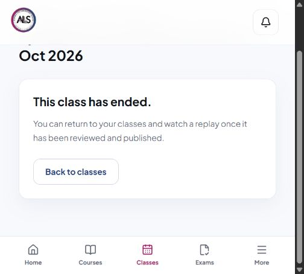
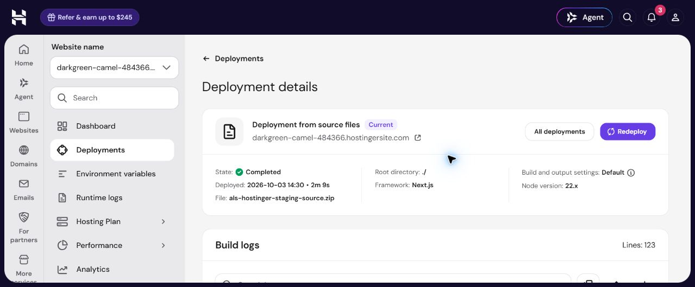
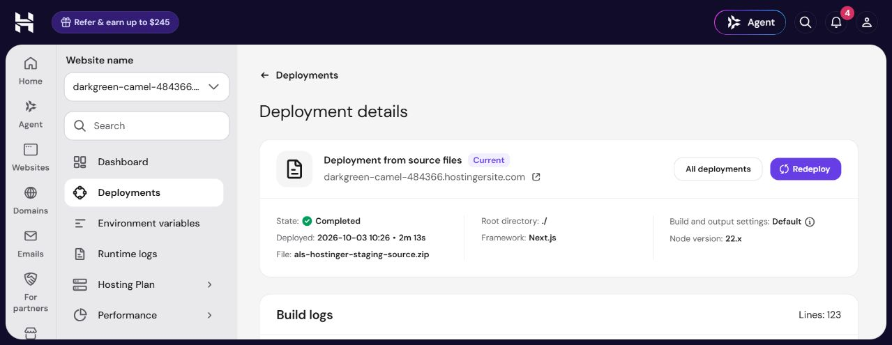

# ALS Step 5 — Student automatic ended state

## Result

**PASS — the reviewed fix is deployed, and real hosted microphone acceptance proved automatic Student ending without refresh. Final staging media state is SAFE, with live/recording/POC disabled and cron paused.**

**Latest checkpoint:** the separately approved staging credential containment is verified. Replacement credentials are deployed; old Cloudflare SFU/TURN/R2 access and the old individually managed Supabase key are retired/rejected; Vault and verified local consumers are updated. All three normal hosted role logins and 21 academic checks passed. See [the containment chronology](ALS-STAGING-CONTAINMENT-2026-10-03.md).

## Completed hosted acceptance

| Requested verdict | Result |
| --- | --- |
| STUDENT AUTO-END STATE | PASS |
| JOIN REMOVED WITHOUT REFRESH | PASS |
| MEDIA STOPPED | PASS |
| TEACHER NORMAL END REGRESSION | PASS |
| DB CLOSURE | PASS |
| PROVIDER CLOSURE | PASS |
| CRON USED | NO |
| ACADEMIC REGRESSION | PASS — 21 read-only hosted checks after End |
| FINAL MEDIA STATE | SAFE |
| PHYSICAL ANDROID | NOT RUN |
| PHYSICAL IPHONE | NOT RUN |
| PRODUCTION | UNCHANGED |

Exactly one fresh synthetic class was used: **`09b74889-c4e0-42b3-8743-afd0059ca5d8`**, **Synthetic ALS Student Auto-End — 3 Oct 2026**. The existing assigned Teacher, eligible Student 1 and canonical synthetic Program/Subject/Batch were preserved. Recording was disabled on the class and in configuration; no camera, screen sharing or recording was used. Preparation resumed after the owner cleared the Chrome blocker; no extra class was created.

The Teacher used normal Start, microphone preflight and Join controls in Chrome. Student 1 joined receive-only in a separate in-app browser. One Teacher microphone publication and one Student subscription were active. Exact replacement-app publisher and receiver sessions both returned HTTP 200 with active local/remote tracks for publication `25ed506e-2cb3-479a-87b2-7bebc2c578c1`. Student diagnostics showed 65–66 kbps microphone RX, zero microphone TX, unmuted playback advancing, and zero camera/screen traffic. Persisted Student microphone RX increased from no prior summary (0) to **797,819 bytes**; Teacher TX was **851,553 bytes**.

The Student page was reloaded before Join to enter the newly started class. **No Student reload, navigation, manual status refetch or rejoin action occurred after Join or during the End observation.** An ended-heading observer was armed before the normal visible **End class for everyone** keyboard activation. No cleanup endpoint or cron was used for this class.

### Normal End chronology — 3 October 2026

| Event | UTC | Asia/Dubai |
| --- | --- | --- |
| End input dispatch initiated | 10:26:18.516 | 14:26:18.516 |
| End input dispatch returned | 10:26:19.042 | 14:26:19.042 |
| Server class completed / both attendance intervals ended | 10:26:19.502 | 14:26:19.502 |
| Microphone publication closed, `confirmed_closed` | 10:26:19.836 | 14:26:19.836 |
| Student subscription closed | 10:26:20.488 | 14:26:20.488 |
| Teacher and Student connections closed | 10:26:21.037 | 14:26:21.037 |
| Student ended heading observed without refresh | 10:26:21.259 | 14:26:21.259 |

The observed server-completion-to-Student-heading interval is **1,757 ms (about 1.76 seconds)**. This compares the server's `ended_at` with the automation's first successful visible-heading observation; it includes observation delay and does not claim an exact browser paint/event timestamp. The input dispatch timestamps bracket automation activation, rather than claiming an independently captured HTTP request timestamp.

Both Teacher and Student showed **This class has ended.** Student Live and Join controls were absent, reconnect controls were absent, and all audio/video elements were removed. Normal Student UI offered no rejoin affordance; focused local tests independently verify terminal-state and retained Join callback guards.

### Exact provider closure

Replacement SFU app: **`9a19a0fbdcf8759c89dd6deba41c5f1f`**, `als-staging-sfu-containment-20261003`.

- Teacher publisher: `1480e5ab98505c77637cbf7b7e277618e49c487e1493ad97057bce329ff3b378`.
- Student receiver: `45798d1fa6a7f6d18f99f000583d5be0f985f7eea7405e621bc42d912e900a39`.
- Exact authenticated inspection begun **10:27:06.992 UTC** returned **410 `session_error` for both sessions**, explicitly absent/expired. The database's publication reconciliation independently recorded `confirmed_closed`. No active provider media remained for the class.

Cron job 1 remained paused throughout. Its latest run ID remained **72**, last start **2026-10-01T14:39:00.025104Z**. Normal closure occurred almost five minutes before the operational cutoff **10:31:27.134 UTC**. Scheduled cleanup did not cause any acceptance transition.

### Deployment and final preservation

- Reviewed application source remains **`3032ed0527ce801a1a675fd331be37bc2a35f002`**; ZIP SHA-256 remains **`454997b2a6ab9aa723cdbc11347d04da60de47f158ad32eddf0dcb73c2dd0bf2`**. No further application source change was made during containment/acceptance.
- Verified live-only window deployment: **`01a10143-ea6b-7112-af80-f22f2ce72482`**, Current/Completed; bounded window **10:21:27.134–10:31:27.134 UTC** (14:21–14:31 Dubai). Recording and POC remained false, all credential settings unchanged.
- Final disabled deployment: **`01a1014e-6b47-7206-8e9e-cae6604dc346`**, Current/Completed. Private saved readback **10:32:15.787 UTC** matched all 25 post-containment values exactly, including all three false flags and restored operational bounds.
- Final database observation **10:33:53.044559 UTC**: zero live classes, open/reconnecting/failed connections, active/closing publications/subscriptions, open attendance, and pending recording/upload/interrupted work.
- Academic preservation matched the pre-window observation exactly: unchanged 47 migrations; five retained synthetic enrollment rows, including expiry **`2026-10-08T07:40:22.181Z`**; published Step 3 recording `ea83d954-a4ef-45b6-b34c-8b80722f3b04`; its ready segment/hash; two recording rows and two segments; watch total **44.013 seconds**.
- All 21 academic/authorization checks passed again after End. No academic fixtures, credentials, accepted recording/replay workflow, Production or Git remotes were changed during this media test.
- Three temporary ignored containment/import copies were removed at **10:37:30.1777135 UTC**, after consumer and final-state verification. Canonical verified local staging consumers remain.

Non-secret hosted evidence is in `docs/evidence/als-step5-hosted-20261003/`. Evidence publication scans include active staging credential values, R2 access ID, account passwords, management token and Vault cleanup token; no secret value was found. The historical Step 3 **NORMAL TEACHER END FAIL/UNVERIFIED** verdict remains unchanged; this successful later acceptance does not rewrite that earlier attempt.

## Original exposure checkpoint

The original 06:37 UTC evidence below is historical. Later containment/class preparation does not revise those timestamps or turn the unrun hosted acceptance into a PASS.

The agent accidentally included staging secret values in a browser tool result while recovering the Hostinger environment-page state. No live window was opened after this exposure. The request explicitly prohibits credential changes, so containment requires separate authorization. No new class was created. No recording, screen share, camera or microphone test was started.

| Requested verdict | Result |
| --- | --- |
| STUDENT AUTO-END STATE | PASS locally; hosted BLOCKED / NOT RUN |
| JOIN REMOVED WITHOUT REFRESH | PASS locally; hosted BLOCKED / NOT RUN |
| MEDIA STOPPED | PASS locally; hosted BLOCKED / NOT RUN |
| TEACHER NORMAL END REGRESSION | PASS locally; hosted BLOCKED / NOT RUN |
| DB CLOSURE | Hosted Step 5 NOT RUN; accepted Step 4 PASS unchanged |
| PROVIDER CLOSURE | Hosted Step 5 NOT RUN; accepted Step 4 PASS unchanged |
| CRON USED | NO |
| ACADEMIC REGRESSION | PASS — 21 read-only hosted checks |
| FINAL MEDIA STATE | SAFE — media entry disabled and zero resources |
| PHYSICAL ANDROID | NOT RUN |
| PHYSICAL IPHONE | NOT RUN |
| PRODUCTION | UNCHANGED |

At the original checkpoint there was no Step 5 class ID. A fresh class is now prepared as recorded above, but End click timestamp and server-completion-to-Student-UI latency remain unmeasured. These require the blocked real-media acceptance. Local results do not establish a hosted pass.

## Source trace and narrow change

Current source, independently inspected, initialized `classStatus` from `session.status`. Teacher lifecycle responses updated only that context. The existing private channel observed messages, participants, questions, poll responses and published tracks, with no `live_sessions` subscription. The track-discovery error `The class is not live` cleared/failed media without replacing the canonical class state.

Staging's `supabase_realtime` publication also omitted `live_sessions`. A narrowly scoped migration adds this one table, retaining its existing RLS policies and grants. No academic or session data row was changed by the migration. It was applied only to project `slghshcdaijbcjfoqerq` / `als-live-staging`, organization `oenarbsvxrmnsvugjdrz`, and verified at **2026-10-03T05:51:17.983780Z**.

`observeSessionStatus` subscribes to UPDATE events filtered by the exact class ID. It accepts only the application's existing states (`draft`, `scheduled`, `live`, `completed`, `cancelled`), ignores mismatched/invalid/older updates, and keeps terminal state from being revived by stale responses. It performs a read-only refetch on subscription/reconnection, browser focus/online/visibility return, media recovery and the authoritative not-live response. Bursts are coalesced with a one-second bound; no periodic status polling or new database writes were added.

For a Student receiving completed/cancelled, NativeClassroom synchronously updates its status reference, closes local peers, stops received tracks/capture, clears connection/publication/subscription maps and reconnect timers, and renders the existing ended UI. Join and late in-flight join results are guarded against terminal state. Teacher End retains its existing recording-stop/control/provider-closure workflow. Recording/replay API source is unchanged.

The existing eligibility, enrollment, batch and Teacher assignment checks remain in force. A Student gains no ability to write session status. Browser status reads/events remain subject to existing RLS. The before/after policy inspection showed the same SELECT/INSERT/UPDATE/DELETE predicates. The Supabase security-advisor connector denied access; no advisor PASS is claimed. Supabase changelog and current Realtime documentation were checked; no relevant breaking change required a dependency or policy change.

## Local verification

- **32 focused tests passed:** nine component lifecycle tests plus 23 recording-route tests.
- **Full Vitest suite:** 327 passed, 13 skipped, 52 passing files and three skipped files.
- **Import tests:** four passed.
- **Lint:** passed with no output.
- **Typecheck:** Next route generation plus TypeScript passed.
- **Production webpack build:** passed.
- **Diff check:** passed.

Component tests exercise an already-joined Student receiving completion, disappearance of Live/Join/audio, peer closure and track stop, blocked retained Join callbacks, cancellation, wrong-class/invalid/non-terminal events, focus/online/subscription refetch, not-live heartbeat errors, unchanged normal Teacher End, completion during an in-flight Join, and coalesced fallback bursts. They use mounted React components and mocked transport/database boundaries. These do not replace real hosted media acceptance.

Two pinned development-only packages (`react-test-renderer` 19.2.8 and its types 19.1.0) support mounted component testing. Runtime dependencies are unchanged. Hostinger reports five high-severity dependency advisories; no broad dependency upgrade or audit fix was performed in this narrow task.

## Deployment

- Application source SHA: **`3032ed0527ce801a1a675fd331be37bc2a35f002`**.
- Accepted prior application baseline: `71be353bec8ceca79e1120b614a83869c199fb97`.
- ZIP SHA-256: **`454997b2a6ab9aa723cdbc11347d04da60de47f158ad32eddf0dcb73c2dd0bf2`**.
- ZIP: 1,314,474 bytes; allowlisted source/public/build files, with no `.env`, local QA configuration or credentials.
- Hostinger deployment: **`01a1006e-eb80-7211-978c-dc8ae2bbbb22`**, **Current/Completed**.
- Submitted **2026-10-03T06:23:42.961Z** / 10:23:42.961 Dubai.
- Completion observed **2026-10-03T06:27:45.531Z**; page displayed deployed 10:26 Dubai.
- Final private readback **2026-10-03T06:33:44.171Z**: all 25 baseline settings identical; live, recording and POC flags all false. No credentials or operational window bounds were changed.
- Existing protected origin: `https://darkgreen-camel-484366.hostingersite.com`.
- No Git push or Git remote change. Production was not accessed or modified.

## Credential exposure and acceptance blocker

During the browser action labelled “Recover environment-page state after selection,” environment values were represented as AX text nodes rather than `Value:` fields. The attempted redaction covered only `Value:` fields, so it failed to mask secret text nodes. The agent owns this mistake. This is evidence of exposure in the conversation/tool trace; it does not prove third-party misuse.

Affected secret categories: Cloudflare SFU app secret, TURN API token, R2 object-access credentials, staging Supabase server key, staging access phrase/cookie secret and cleanup token. No secret value is repeated or stored in this report/evidence. Non-secret SFU app ID is `6306f9d5f836a1aa08b0d6bbde22f10b`; TURN key ID is `19951d8aa17f40210ffc756ba8c1ba3a`; R2 bucket is `als-live-poc-recordings`.

Media acceptance was stopped before class creation or window activation. Environment values were hidden again. Subsequent observations redact known private values before output, and only non-secret flags/comparison results were saved. The Hostinger management tab was closed after final readback.

At the original checkpoint, separate containment authorization was required for the staged plan above. The owner subsequently granted that separate approval, and containment was completed as documented in the linked chronology. The original Step 5 source fix did not change credentials; the later containment was a separately authorized operation.

## Final preservation and media state

Final database observation **2026-10-03T06:37:03.025539Z** / 10:37:03.025539 Dubai:

- Zero live classes, open/reconnecting/failed connections, active/closing publications and subscriptions, open attendance and pending recording/upload/interrupted segments.
- Cleanup cron job 1 `als-live-staging-cleanup` remains paused. Latest run ID remains **72** (2026-10-01T14:39:00.025104Z); no cleanup endpoint call or cron resume.
- No Step 5 provider session created. Final read-only inspection at **2026-10-03T06:36:51.086Z** confirmed the two exact Step 4 publisher/receiver sessions remain **410 `session_error`**, no tracks.
- Step 3 recording `ea83d954-a4ef-45b6-b34c-8b80722f3b04` remains published; segment checksum, owner, duration, bytes and timestamps are unchanged. Two recording rows and two segment rows remain.
- Original enrollment IDs/statuses/start/expiry, watch total 44.013 seconds and other retained recording evidence match baseline. Migration count changed only from 46 to 47 for the status publication addition.
- Credentials, enrollment expiry, academic fixtures and accepted recording/replay workflow were not changed.

“SAFE” above describes final media resource state. Credential containment is outstanding, so no claim of credential safety or complete Step 5 acceptance is made. Stop here pending separate authorization.

Non-secret evidence is in `docs/evidence/als-step5-auto-end-20261003/`; private configuration and helpers remain ignored under `.local-qa/step5-auto-end-20261003/`.
